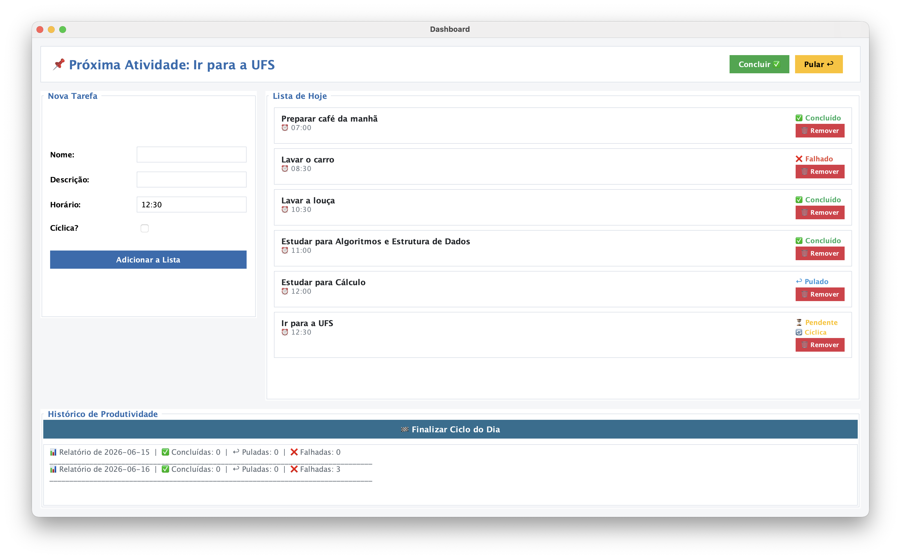

# Manual do Usuário - Sistema de Agenda e Gerenciamento de Atividades (AgendaUI)

Este manual apresenta as instruções de uso, as regras de negócio, a arquitetura interna e o fluxo de execução do sistema Agenda. O projeto foi desenvolvido com foco no gerenciamento de compromissos diários e na análise da produtividade pessoal.

A interface principal do usuário é a classe [AgendaUI](file:///Users/luizpoderoso/Estudos/ufs/2026.1/estrutura-de-dados/projetos/Agenda/Agenda/src/UI/AgendaUI.java).

---

## Visão Geral do Sistema

O sistema de Agenda permite criar tarefas com horários específicos, marcar o progresso de cada tarefa como Concluído ou Pulado, monitorar tarefas Falhadas de forma automática por tempo excedido, repetir tarefas periodicamente por meio de marcação cíclica, e gerar relatórios de produtividade arquivados em histórico.

---

## Arquitetura e Estruturas de Dados

Para cumprir os requisitos de estruturas de dados do projeto, o sistema utiliza implementações personalizadas na memória em conjunto com um banco de dados local para persistência:

### 1. Lista Duplamente Encadeada Circular (Classe [Agenda](file:///Users/luizpoderoso/Estudos/ufs/2026.1/estrutura-de-dados/projetos/Agenda/Agenda/src/core/Agenda.java))
As tarefas diárias de uma agenda são organizadas em uma Lista Duplamente Encadeada Circular composta por nós da classe [Tarefa](file:///Users/luizpoderoso/Estudos/ufs/2026.1/estrutura-de-dados/projetos/Agenda/Agenda/src/core/Tarefa.java):
* **Ordenação Cronológica**: As tarefas são inseridas na lista mantendo a ordem crescente de horário (LocalTime).
* **Navegação Circular**: O ponteiro `ultimo` aponta para a última tarefa do dia (a mais tardia). Consequentemente:
  * O primeiro elemento (o mais cedo) é acessado por `ultimo.proxTarefa`.
  * O elemento anterior ao primeiro é o próprio `ultimo` (`primeiro.antTarefa = ultimo`).
* **Inserção Ordenada**: Ao adicionar uma nova tarefa, o sistema encontra dinamicamente o intervalo correto na lista de acordo com o horário informado. Se houver choque de horário, a operação falhará.

### 2. Lista Encadeada Simples (Classe [Historico](file:///Users/luizpoderoso/Estudos/ufs/2026.1/estrutura-de-dados/projetos/Agenda/Agenda/src/core/Historico.java))
O histórico de produtividade armazena os relatórios diários de dias anteriores por meio de uma Lista Encadeada Simples de nós do tipo [Relatorio](file:///Users/luizpoderoso/Estudos/ufs/2026.1/estrutura-de-dados/projetos/Agenda/Agenda/src/core/Relatorio.java):
* Cada nó aponta para o próximo relatório do histórico através de `proxRel`.
* Permite visualizar a evolução da produtividade (tarefas concluídas, falhas e puladas) ao longo do tempo.

### 3. Persistência de Dados (Classe [GerenciadorBanco](file:///Users/luizpoderoso/Estudos/ufs/2026.1/estrutura-de-dados/projetos/Agenda/Agenda/src/dao/GerenciadorBanco.java))
O sistema utiliza o banco de dados SQLite (`db/database.db`) para assegurar que as tarefas e o histórico persistam entre as execuções da aplicação.
* A tabela `tarefa` possui uma constraint `UNIQUE(id_agenda, horario)`, garantindo que duas tarefas não possam ter o mesmo horário no mesmo dia.
* Ao abrir o aplicativo, a agenda do dia atual é carregada ou criada caso ainda não exista.

---

## Fluxo da Interface Gráfica (AgendaUI)

A tela principal do sistema é dividida em quatro painéis estratégicos, conforme ilustrado no esquema abaixo:




### 1. Painel de Atividade Atual (Topo)
Exibe dinamicamente a próxima atividade que precisa ser executada baseada no horário e no status Pendente.
* **Botão Concluir**: Altera o status da tarefa atual para Concluido.
* **Botão Pular**: Altera o status da tarefa atual para Pulado.
* Ao clicar em qualquer uma das opções, o status é persistido no banco de dados e a interface determina e exibe a próxima tarefa pendente de forma sequencial.

### 2. Formulário de Nova Tarefa (Esquerda)
Permite adicionar um compromisso à agenda.
* **Campos**:
  * **Nome**: Título resumido da tarefa (obrigatório).
  * **Descrição**: Informações detalhadas sobre a atividade (opcional).
  * **Horário**: Deve seguir o padrão HH:mm (ex: 07:30, 14:00).
  * **Cíclica?**: Checkbox que define se a tarefa deve se repetir automaticamente no dia seguinte.
* **Adicionar à Lista**: Insere a tarefa na estrutura da agenda diária. Caso ocorra um erro de formato de hora ou choque de horários (restrição de chave primária composta no banco), um alerta visual é exibido para o usuário.

### 3. Painel "Lista de Hoje" (Direito)
Apresenta todas as tarefas cadastradas para o dia atual em ordem cronológica de horário. Cada cartão de tarefa apresenta:
* O nome, descrição e horário programado.
* O status atual da tarefa, representado por badges visuais coloridos:
  * Pendente (Amarelo)
  * Concluído (Verde)
  * Pulado (Azul)
  * Falhado (Vermelho)
* Um indicador visual Cíclica caso a tarefa seja recorrente.
* Um botão Remover: Deleta a tarefa da agenda do dia na memória e no banco de dados SQLite.

### 4. Painel de Histórico e Encerramento de Ciclo (Base)
* **Botão Finalizar Ciclo do Dia**:
  1. Avalia as tarefas da agenda atual e gera um [Relatorio](file:///Users/luizpoderoso/Estudos/ufs/2026.1/estrutura-de-dados/projetos/Agenda/Agenda/src/core/Relatorio.java) estatístico do dia.
  2. Adiciona o relatório à lista encadeada do [Historico](file:///Users/luizpoderoso/Estudos/ufs/2026.1/estrutura-de-dados/projetos/Agenda/Agenda/src/core/Historico.java).
  3. Cria e registra uma nova [Agenda](file:///Users/luizpoderoso/Estudos/ufs/2026.1/estrutura-de-dados/projetos/Agenda/Agenda/src/core/Agenda.java) correspondente ao dia seguinte (LocalDate.now() + 1 dia).
  4. Migra todas as tarefas marcadas como Cíclicas para a nova agenda do dia seguinte, reiniciando o status delas para Pendente.
  5. Carrega a nova agenda na tela para uso.
* **Caixa de Histórico de Produtividade**: Exibe o log acumulado de relatórios com as datas e a performance (número de tarefas concluídas, falhas e puladas).

---

## Regras de Negócio e Comportamentos Especiais

### Falha por Decurso de Prazo (Tarefa Expirada)
O sistema possui uma regra de expiração inteligente na classe [Gerenciador](file:///Users/luizpoderoso/Estudos/ufs/2026.1/estrutura-de-dados/projetos/Agenda/Agenda/src/core/Gerenciador.java):
* Quando o método `definirTarefaAtual()` é acionado e o horário atual do sistema ultrapassou o horário configurado para tarefas posteriores, todas as tarefas anteriores que ainda estiverem com o status Pendente são atualizadas automaticamente no banco de dados e na memória para o status Falhado (`StatusTarefa.Falhado`).
* Isso garante que tarefas passadas que não foram explicitamente concluídas ou puladas a tempo constem de forma fidedigna como falhas no relatório diário.

---

## Como Executar o Projeto

Certifique-se de estar na raiz do diretório do projeto e execute os seguintes comandos no terminal:

### 1. Compilação
Compile todos os arquivos Java direcionando as classes compiladas para a pasta `out` e referenciando a biblioteca de driver JDBC do SQLite:

**Linux / macOS:**
```bash
javac -cp "libs/*" -d out src/core/*.java src/dao/*.java src/UI/*.java src/*.java
```

**Windows (Prompt de Comando):**
```cmd
javac -cp "libs\*" -d out src\core\*.java src\dao\*.java src\UI\*.java src\*.java
```

### 2. Execução da Interface Principal (AgendaUI)
Execute a aplicação gráfica principal utilizando os arquivos de classe no diretório `out` e o classpath referenciado para a biblioteca de banco de dados SQLite:

**Linux / macOS:**
```bash
java -cp "out:libs/sqlite-jdbc-3.53.2.0.jar" UI.AgendaUI
```

**Windows (Prompt de Comando):**
```cmd
java -cp "out;libs/sqlite-jdbc-3.53.2.0.jar" UI.AgendaUI
```

---

## Como Executar os Testes Unitários

O projeto possui um conjunto de testes unitários na classe [TestGerenciador](file:///Users/luizpoderoso/Estudos/ufs/2026.1/estrutura-de-dados/projetos/Agenda/Agenda/src/TestGerenciador.java) que valida os comportamentos de alteração e expiração de tarefas.

Para rodá-los:

**Linux / macOS:**
```bash
java -cp "out:libs/sqlite-jdbc-3.53.2.0.jar" TestGerenciador
```

**Windows (Prompt de Comando):**
```cmd
java -cp "out;libs/sqlite-jdbc-3.53.2.0.jar" TestGerenciador
```
